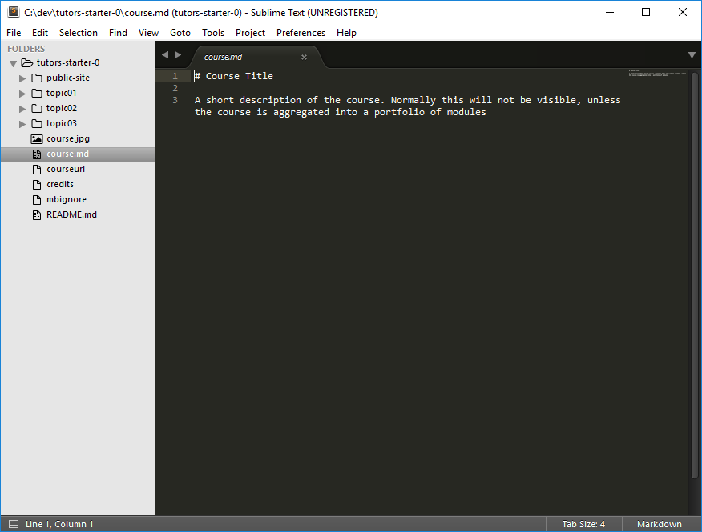
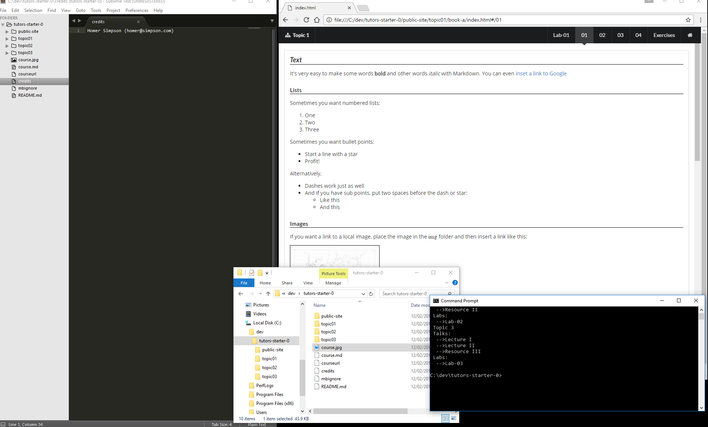

# Exercises

## Exercise 1: Labs

Open one of the labs:

Experiment with the menu bar along the top. The behaviour of the numbers is clear enough - it moves the student through a particular lesson (like this one). Try `left-arrow` and `right-arrow` - they should navigate forward and backward though the steps.

However, the other icons + titles are also navigable. Try them now to see where they lead.

## Exercise 2: Editing the Course Sources

Make sure you can open sublime - and have the complete courseweb open in the side panel (use open->folder to do this):

We can make a small change as an initial experiment. Open the `credits` file, and replace 'your name' with your own name, and email or whatever.

Save the changes, and run the tutors command again. Refresh the browser, and verify that your name has appeared in the header:

and at the foot of each lab:

## Exercise 3: Organising your workspace

When building a course, you often need several applications available concurrently:

- Submlime Text Editor ... to compose the course
- Web Browser ... to see the current generated version of the course web
- Shell ... to regenerate the course when you with to view the latest version
- File Explorer/Finder ... to rename/reorganise the folders/files as you develop the course.

These could be organised like this -

or any other suitable structure...

To summarise:

- use Sublime to edit the course 'sources' (all files except those in the `public-site` directory).
- use A web browser to review `public-site` directory only
- run the 'tutors' command to period