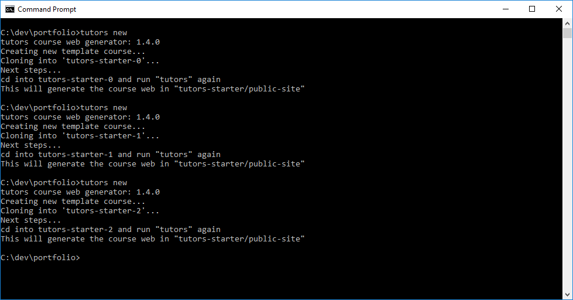
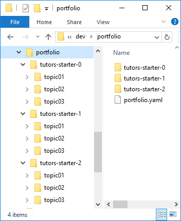
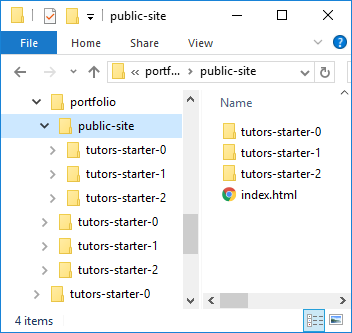
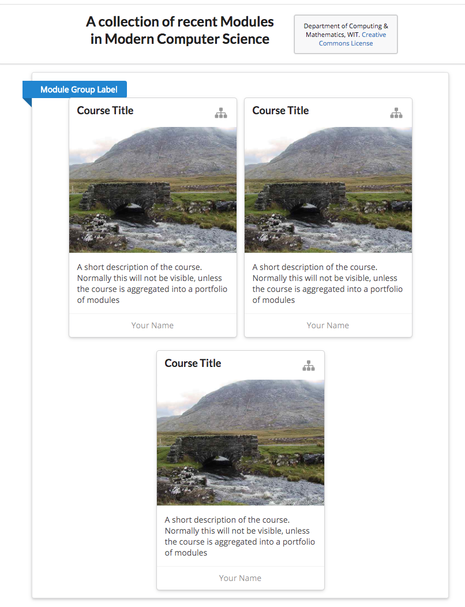

# Portfolio Example

The easiest way to explore portfolios is to have tutors generate a set of starter courses, and automatically aggregate them.

Create a an empty folder - called `portfolio` below (but can be any name) - and use tutors to create three new courses:

~~~
tutors new
tutors new
tutors new
~~~

This will generate a folder structure like this:

Each is a standalone course, and individual `public-site` folders can be generated by running tutors in each folder.

However, tutors can also be run in the portfolio folder itself:

~~~
tutors
tutors course web generator: 1.4.0
- tutors-starter-0
- tutors-starter-1
- tutors-starter-2
 Topic 1
 Talks:
 ....
 ....
~~~

This will generate a `public-site` in as a subdirectory of portfolio:

... and this version is an aggregate of the three courses:

Each of these is an individual module, with the revised navigation as discussed before.